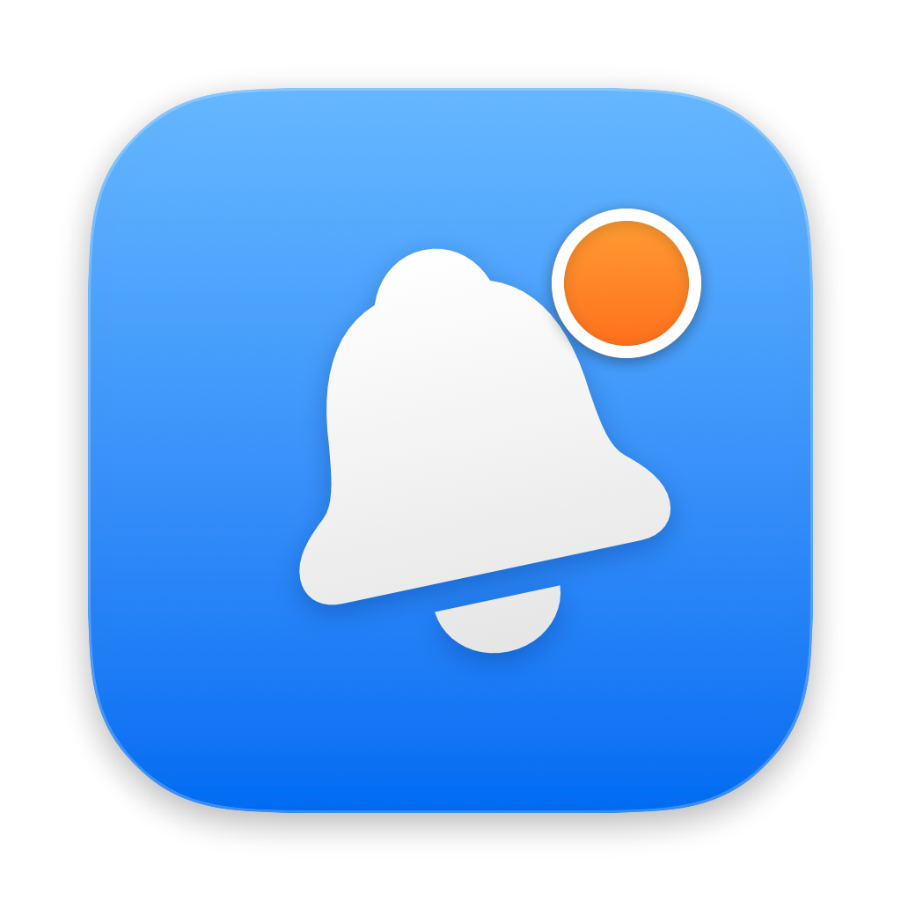
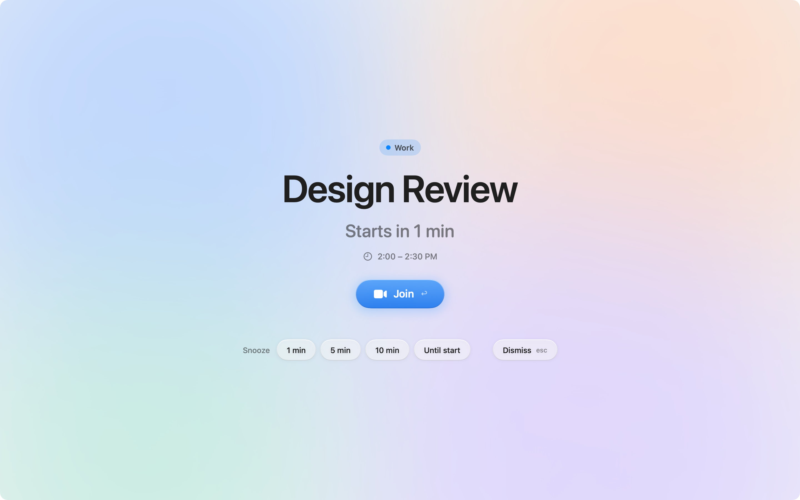
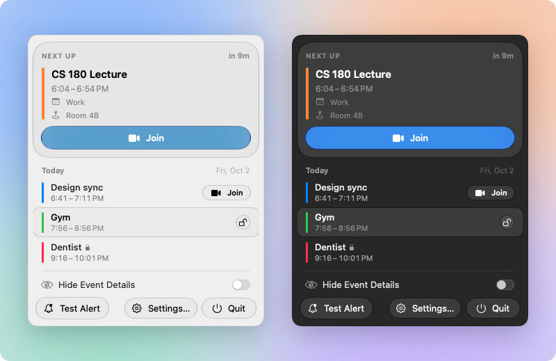

<p align="center"></p>

<h1 align="center">HeadsUp</h1>

<p align="center">Full-screen reminders for your Mac, right before your meetings start.</p>



HeadsUp is a free menu-bar app that takes over every screen a minute before your next event, with a big **Join** button for the call. Notification banners are easy to miss. This isn't.

It reads whatever Apple Calendar can see (iCloud, Google, Exchange/Outlook), so there's no sign-in and no account to make.

## Features

- **Full-screen alert** on every display, with a one-click Join for Zoom, Google Meet and Microsoft Teams links. `Return` joins, `Esc` dismisses.
- **Snooze** for 1, 5 or 10 minutes, or until the event starts.
- **Per-calendar alert times**: 10 minutes before, 1 minute before, at start, or any mix.
- **Pick what alerts**: turn whole accounts or single calendars on and off.
- **Private events**: hide the details of one event, a whole calendar, or everything at once. Can also hide automatically when you're away from a trusted Wi-Fi network, so a meeting title never pops up on a projector or in a café.
- **Stays out of your presentations**: no full-screen alert while you're sharing, recording or mirroring your screen, or playing a Keynote or PowerPoint slideshow.
- **Menu-bar countdown** to your next event, plus a panel with today's agenda and Join buttons.
- Skips all-day, declined and canceled events. Events that start together share one alert.

<p align="center"></p>

## Install

1. Download the latest `HeadsUp.dmg` from [Releases](https://github.com/ion05/headsup/releases).
2. Open it and drag HeadsUp to Applications.
3. Launch it. HeadsUp asks for Calendar access the first time; it needs this to see your events.

Requires macOS 14 or later. The Liquid Glass look needs macOS 26; older versions get a matching flat style.

## Privacy

Everything stays on your Mac. HeadsUp has no servers, no accounts and no analytics. It reads events through Apple Calendar and stores its settings locally. The only network request it makes is the update check, which fetches the release feed from GitHub and can be turned off in Settings.

Location access is only requested if you turn on auto-hide for untrusted Wi-Fi. macOS requires it to read the Wi-Fi network name; HeadsUp never reads or stores your location.

## Tips

- **Shared or delegated Google calendars** are off by default in Apple Calendar. Turn them on in **Calendar → Settings → Accounts → Google → Delegation** and they show up in HeadsUp.
- **Work Outlook/Exchange calendar, but your org blocks third-party apps?** Add the account in **System Settings → Internet Accounts** instead. HeadsUp only talks to Apple Calendar, so it never needs its own access to your company's account.
- Use **Send test alert** in Settings to see what an alert looks like.

## Build from source

Requires macOS 14+ and Xcode.

```sh
./build.sh      # builds, signs and installs to ~/Applications/HeadsUp.app
swift test      # unit tests
```

`build.sh` signs with your first "Apple Development" identity (set `SIGN_ID` to override) and falls back to ad-hoc signing.

The app icon, DMG background and README images are drawn in code: `swift design/render.swift`.

## Releasing

One command: `scripts/release.sh <version>`. Setup and details in [docs/RELEASING.md](docs/RELEASING.md).

## License

[MIT](LICENSE)
